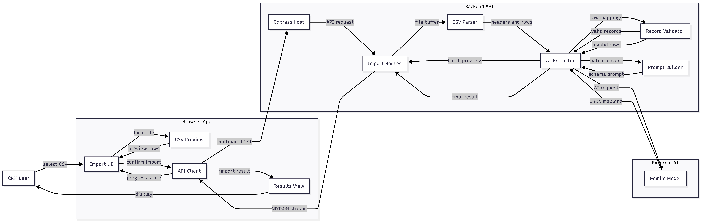

# AI-Powered CSV Importer for GrowEasy CRM

An intelligent CSV import pipeline that ingests lead data from **any** CSV layout — Facebook Lead Ads exports, Google Ads exports, real estate CRM dumps, sales reports, or manually maintained spreadsheets — and uses Google Gemini to map arbitrary, inconsistent column structures into a fixed, validated GrowEasy CRM schema.

The core engineering problem this project solves is not CSV parsing. It is reliable, schema-constrained field mapping across heterogeneous, unpredictable input formats, delivered inside a product experience that looks and behaves like it belongs in GrowEasy itself — with production-grade handling of AI failure modes: retries, timeouts, malformed responses, and invalid enum values.

---

## Table of Contents

- [Overview](#overview)
- [Design Parity with the GrowEasy Product](#design-parity-with-the-groweasy-product)
- [Assignment Requirements Coverage](#assignment-requirements-coverage)
- [Key Features](#key-features)
- [Architecture](#architecture)
- [Tech Stack](#tech-stack)
- [Project Structure](#project-structure)
- [Getting Started](#getting-started)
  - [Prerequisites](#prerequisites)
  - [Backend Setup](#backend-setup)
  - [Frontend Setup](#frontend-setup)
  - [Running with Docker](#running-with-docker)
- [How It Works](#how-it-works)
- [CRM Field Mapping](#crm-field-mapping)
- [API Reference](#api-reference)
- [Testing & Quality Checks](#testing--quality-checks)
- [Sample Test Data](#sample-test-data)
- [Environment Variables](#environment-variables)
- [What Sets This Submission Apart](#what-sets-this-submission-apart)
- [Author](#author)

---

## Overview

Businesses generate leads from many disconnected channels, and each channel exports data differently. A Facebook Lead Ads CSV, a Google Ads export, and a manually assembled spreadsheet from a marketing agency rarely share column names, ordering, or formatting — yet all of them ultimately need to become the same thing: a clean, structured lead record inside the CRM.

This project builds that translation layer. A user uploads any valid CSV, previews the raw parsed data with zero AI involvement, explicitly confirms the import, and only then does the backend batch the records to Gemini for intelligent, schema-constrained field extraction. Every AI response is independently validated and sanitized server-side before it is trusted — the system never assumes the model's output is correct by default.

## Design Parity with the GrowEasy Product

Before writing any code, the reference screenshots included in the assignment were studied closely, and the interface was deliberately rebuilt to feel like a native extension of GrowEasy's existing dashboard, rather than a generic bolt-on tool. This was a conscious product decision: an internal tool that looks foreign to the product it serves creates friction for the team that has to use it every day.

Specifically, the implementation mirrors the reference product in:

- **Navigation shell** — the same left sidebar structure, section labeling, and active-state highlighting as the GrowEasy dashboard.
- **Page header copy and layout** — a page title, descriptive subtitle, search bar, and a primary action button in the same position and the same brand green as the reference.
- **The import modal itself** — matching title and helper copy, a dashed-border drop zone with upload iconography, identical "drag & drop or click to browse" language, a file-size limit notice, and a template-download action — down to the same **orange** primary "Upload File" call-to-action used in the reference screenshots, rather than defaulting to the brand green used elsewhere in the UI.
- **The post-import summary** — colored count pills for imported vs. skipped records and a "View Skipped Records" link, presented the same way a product-mature dashboard would surface a batch operation's outcome.
- **The results table** — the same column vocabulary (Lead Name, Email, Contact, Date Created, Company, Status, Source, Actions) and the same color-coded status pill treatment (e.g. green for a good lead, red for a bad lead, blue for a closed sale) as the reference "Manage Your Leads" screen.
- **Light and dark mode**, including the same toggle placement and interaction pattern shown in the reference screenshots.

The intent was to remove any doubt that this could be dropped into the existing product with minimal design review.

## Assignment Requirements Coverage

| Requirement (from assignment) | Status | Notes |
| --- | :---: | --- |
| Drag & drop **and** file picker upload | ✅ | Both supported in `FileUpload` |
| CSV preview with no AI processing | ✅ | Client-side streaming parse; backend is not called until confirmation |
| Responsive preview table, horizontal + vertical scrolling | ✅ | `DataTable` component |
| Explicit confirm step gating the backend call | ✅ | Backend is only invoked after **Confirm Import** |
| Accept any valid CSV, no fixed column assumption | ✅ | AI-driven mapping, not hardcoded column lookups |
| CSV → structured record parsing | ✅ | `csvParser.ts` (PapaParse, BOM-safe) |
| Batched AI extraction | ✅ | Batches of 50 records per Gemini call |
| Structured JSON response | ✅ | Typed `ImportResult` returned from both endpoints |
| Display imported + skipped records with totals | ✅ | `ResultsView` |
| Drag & drop upload *(bonus)* | ✅ | |
| Progress indicators during AI processing *(bonus)* | ✅ | Real batch-level progress, not simulated |
| Streaming / incremental parsing *(bonus)* | ✅ | NDJSON stream over `/api/import/stream` |
| Retry mechanism for failed AI batches *(bonus)* | ✅ | Exponential backoff, 3 attempts |
| Virtualized table for large CSVs *(bonus)* | ⚠️ Partial | Paginated rendering (50 rows/page) rather than a virtualized scroll window |
| Dark mode *(bonus)* | ✅ | |
| Unit tests *(bonus)* | ✅ | 29 tests, 96% coverage on the AI extraction module |
| Docker setup *(bonus)* | ✅ | `docker-compose.yml`, per-service `Dockerfile` |
| Deployment *(bonus)* | ⬜ | See hosted URL in submission email |
| Well-written README *(bonus)* | ✅ | This document |

## Key Features

| Category | Capability |
| --- | --- |
| Upload | Drag-and-drop or file picker, `.csv` only, 10 MB limit |
| Preview | Client-side streaming CSV parse and preview table — **no AI calls until confirmed** |
| Confirmation Gate | Import only proceeds to the backend after explicit user confirmation |
| AI Extraction | Batched Gemini calls with prompt-engineered, schema-constrained field mapping |
| Live Progress | Real-time NDJSON streaming of batch-by-batch progress to the UI |
| Resilience | Automatic retry with exponential backoff on transient AI failures |
| Validation | Server-side re-validation of every AI-returned field against strict enums and formats |
| Data Integrity | Rows with neither a valid email nor mobile number are automatically skipped, with reasons |
| Results | Responsive tables for imported and skipped records, with import/skip totals |
| Theming | Dark and light mode, matched to the GrowEasy product |
| Testing | Automated unit test suite covering parsing, prompt construction, and AI extraction logic |
| Deployment | Dockerized frontend and backend with Docker Compose orchestration |

## Architecture



A full Mermaid diagram of this pipeline, including the retry loop and validation stage, is available in [`architecture.mermaid`](./architecture.mermaid).

## Tech Stack

| Layer | Technology |
| --- | --- |
| Frontend | Next.js, React, TypeScript |
| Backend | Node.js, Express, TypeScript |
| CSV Parsing | PapaParse (streaming, both client and server) |
| AI | Google Gemini (`gemini-3.1-flash-lite`) |
| File Uploads | Multer |
| Testing | Jest, ts-jest |
| Containerization | Docker, Docker Compose |

## Project Structure

```text
CRM/
├── backend/
│   ├── src/
│   │   ├── index.ts              # Express app entrypoint, middleware, CORS, rate limiting
│   │   ├── routes/
│   │   │   └── import.ts         # POST /api/import and /api/import/stream
│   │   ├── services/
│   │   │   ├── csvParser.ts      # CSV → structured record parsing (PapaParse)
│   │   │   ├── aiExtractor.ts    # Gemini batching, retries, sanitization, progress events
│   │   │   └── __tests__/
│   │   ├── utils/
│   │   │   ├── prompt.ts         # Extraction prompt construction
│   │   │   └── __tests__/
│   │   └── types/
│   │       └── crm.ts            # Shared CRM record and result types
│   └── Dockerfile
├── frontend/
│   ├── src/
│   │   ├── app/                  # Next.js app router pages
│   │   ├── components/           # FileUpload, DataTable, ResultsView, ThemeToggle, etc.
│   │   ├── lib/                  # api.ts (fetch + stream reader), csvPreview.ts
│   │   └── types/
│   └── Dockerfile
├── test-data/                    # Sample CSVs covering diverse real-world layouts
├── docker-compose.yml
└── README.md
```

## Getting Started

### Prerequisites

- Node.js 18 or newer
- npm 9 or newer
- A Google Gemini API key — create one at [Google AI Studio](https://aistudio.google.com/apikey)

### Backend Setup

```bash
cd backend
npm install
```

Create a `.env` file in `backend/`:

```env
GEMINI_API_KEY=your_gemini_api_key_here
PORT=3001
FRONTEND_URL=http://localhost:3000
```

Start the backend in development mode:

```bash
npm run dev
```

The API will be available at `http://localhost:3001`.

### Frontend Setup

```bash
cd frontend
npm install
```

Create a `.env.local` file in `frontend/`:

```env
NEXT_PUBLIC_API_URL=http://localhost:3001/api
```

Start the frontend in development mode:

```bash
npm run dev
```

The application will be available at `http://localhost:3000`.

### Running with Docker

To run both services together with a single command:

```bash
GEMINI_API_KEY=your_gemini_api_key_here docker-compose up --build
```

| Service | URL |
| --- | --- |
| Frontend | http://localhost:3000 |
| Backend | http://localhost:3001 |

## How It Works

1. **Upload** — The user uploads a CSV file via drag-and-drop or file picker.
2. **Preview** — The file is parsed entirely client-side, row-by-row, using a streaming parser. A preview table is shown with the total row and column count. No data leaves the browser at this stage, and no AI call is made.
3. **Confirm** — The user reviews the preview and explicitly clicks **Confirm Import**. This is the only action that triggers a backend request.
4. **Parse & Batch** — The backend re-parses the uploaded file and splits records into batches of 50.
5. **AI Extraction** — Each batch is sent to Gemini with a prompt that enforces the target CRM schema, exact enum values for `crm_status` and `data_source`, and explicit rules for handling duplicate emails/phone numbers and unparseable dates.
6. **Validation** — Every field returned by Gemini is independently re-validated server-side: enum values are checked against an allow-list, email addresses against a format pattern, dates against `Date.parse`, and phone numbers against a digit-length range. Anything that fails validation is reset to an empty string rather than trusted blindly.
7. **Skip Logic** — Rows with neither a valid email nor a valid mobile number are excluded from the imported set and returned separately with a reason.
8. **Live Progress** — Progress events are streamed back to the frontend as each batch completes, driving a real progress bar rather than a simulated one.
9. **Results** — The frontend displays the imported records and skipped records in separate responsive tables, along with total counts.

## CRM Field Mapping

The AI extraction step maps arbitrary source columns onto the following fixed schema:

| Field | Description |
| --- | --- |
| `created_at` | Lead creation date, normalized to a JavaScript `Date`-parseable format |
| `name` | Full name of the lead |
| `email` | Primary email address |
| `country_code` | Phone country code (e.g. `+91`) |
| `mobile_without_country_code` | Mobile number, excluding country code |
| `company` | Company or organization name |
| `city` | City |
| `state` | State or province |
| `country` | Country |
| `lead_owner` | Lead owner name or email |
| `crm_status` | One of the allowed status values below, or blank |
| `crm_note` | Remarks, follow-ups, or any additional emails/numbers found |
| `data_source` | One of the allowed source values below, or blank |
| `possession_time` | Property possession timeline |
| `description` | Additional free-text description |

**Allowed `crm_status` values:** `GOOD_LEAD_FOLLOW_UP` · `DID_NOT_CONNECT` · `BAD_LEAD` · `SALE_DONE`

**Allowed `data_source` values:** `leads_on_demand` · `meridian_tower` · `eden_park` · `varah_swamy` · `sarjapur_plots`

If multiple email addresses or phone numbers are present in a source row, the first is used for the corresponding field and the rest are appended to `crm_note`. Rows with neither a valid email nor a valid mobile number are skipped entirely.

## API Reference

### `POST /api/import`

Accepts a single CSV file and returns the complete result once all batches have finished processing.

**Request:** `multipart/form-data`, field name `file`

**Response:**

```json
{
  "records": [],
  "skipped": [],
  "totalImported": 0,
  "totalSkipped": 0
}
```

### `POST /api/import/stream`

Identical input to `/api/import`, but streams newline-delimited JSON (NDJSON) progress events as each batch completes, ending with a final result event. This is the endpoint the frontend uses to drive its live progress indicator.

**Request:** `multipart/form-data`, field name `file`

**Response:** `application/x-ndjson`, one JSON object per line:

```json
{"type": "progress", "phase": "parsing", "progress": 5}
{"type": "progress", "phase": "batch_completed", "currentBatch": 1, "totalBatches": 2, "imported": 50, "skipped": 0, "progress": 52}
{"type": "result", "result": { "records": [], "skipped": [], "totalImported": 0, "totalSkipped": 0 }}
{"type": "error", "error": "message"}
```

## Testing & Quality Checks

| Check | Command |
| --- | --- |
| Backend unit tests | `cd backend && npm test` |
| Backend test coverage | `cd backend && npm test -- --coverage` |
| Backend type check | `cd backend && npm run typecheck` |
| Frontend lint | `cd frontend && npm run lint` |
| Frontend type check | `cd frontend && npx tsc --noEmit` |
| Frontend production build | `cd frontend && npm run build` |

The backend test suite covers CSV parsing edge cases, prompt construction, and the full AI extraction pipeline — including batching, retry-then-success, retry exhaustion, and malformed-response handling — using a mocked Gemini client so tests run deterministically without network access or a live API key.

## Sample Test Data

The `test-data/` directory contains representative CSVs for validating AI mapping accuracy across different real-world layouts:

| File | Scenario |
| --- | --- |
| `01_standard_clean.csv` | Well-formed CRM-style data |
| `02_facebook_leads.csv` | Facebook Lead Ads export format |
| `03_google_ads_export.csv` | Google Ads lead export format |
| `04_real_estate_crm.csv` | Real estate CRM export format |
| `05_messy_manual_spreadsheet.csv` | Inconsistent, manually maintained spreadsheet |

In addition to these, the system was stress-tested against a second, larger set of synthetic datasets (170–230 rows each, spanning the same five real-world categories named in the assignment) purpose-built to exercise multi-batch AI extraction, duplicate-contact merging, and the no-email/no-mobile skip rule at volume rather than on a handful of sample rows.

## Environment Variables

**Backend (`backend/.env`)**

| Variable | Required | Description |
| --- | --- | --- |
| `GEMINI_API_KEY` | Yes | API key for Google Gemini |
| `PORT` | No | Port the Express server listens on (default `3001`) |
| `FRONTEND_URL` | No | Allowed CORS origin for the frontend (default `http://localhost:3000`) |

**Frontend (`frontend/.env.local`)**

| Variable | Required | Description |
| --- | --- | --- |
| `NEXT_PUBLIC_API_URL` | No | Base URL of the backend API (default `http://localhost:3001/api`) |

## What Sets This Submission Apart

- **Product fidelity, not just feature completeness.** The reference screenshots were treated as a specification in their own right. Layout, copy, color choices (including the reference's deliberate use of orange specifically for the upload action, distinct from the brand green used elsewhere), and interaction patterns were matched intentionally — signaling product judgment, not only engineering ability.
- **Real streaming, not a simulated progress bar.** Most take-home submissions fake progress with a `setInterval` counting up to 90%. This implementation streams genuine per-batch NDJSON events from the backend, consumed by a hand-written buffered stream reader on the frontend that correctly handles partial network chunks and a trailing unflushed line — a detail that's easy to get subtly wrong.
- **Zero-trust handling of AI output.** Nothing returned by Gemini is written to a response without being independently re-validated server-side against the exact enum lists, an email format check, a phone-length check, and JavaScript `Date`-parseability. The system is designed around the assumption that the model will occasionally be wrong, not the hope that it won't be.
- **Resilience engineering around the AI call itself.** Timeout wrapping, exponential backoff across three attempts, and batch-level (rather than whole-import-level) failure isolation mean one bad batch degrades gracefully instead of failing the entire import.
- **Test coverage where it's hardest to get, not just where it's easy.** 29 automated tests reach 96% coverage on `aiExtractor.ts` — the batching, retry, and validation logic — using a mocked Gemini client. This is the file most take-home submissions leave untested because mocking an LLM call is inconvenient; it's covered here specifically because it's the highest-risk part of the system.
- **Validated against realistic scale, not just the four sample rows in the spec.** In addition to the five reference CSVs, the system was run against a second set of larger (170–230 row), deliberately messy synthetic datasets modeled on each of the five real-world CSV categories the assignment names by name, confirming multi-batch behavior and skip-rule correctness at volume.
- **End-to-end type safety.** Shared, explicit TypeScript types for the CRM schema and API contracts across both frontend and backend, with a clean `tsc --noEmit` on both sides — no `any`-typed escape hatches in the core data path.

## Author

**Hardik Pandey**
B.Tech, Computer Science Engineering (AI/ML) — VIT Bhopal

- GitHub: [github.com/hardik0903](https://github.com/hardik0903)
- Portfolio: [hardikpandey.in](https://hardikpandey.in)
- Email: hardikpandey0903@gmail.com
